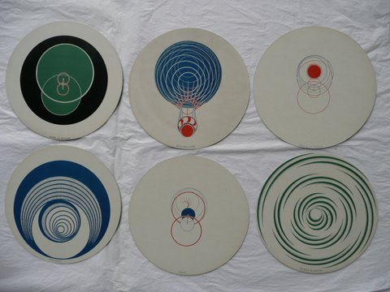
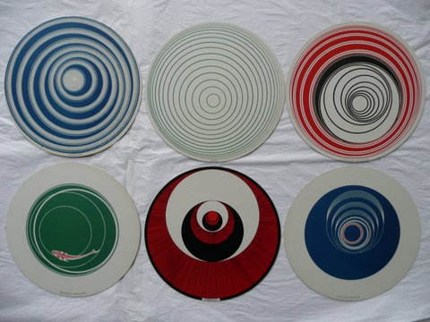

<a href="/pages/activites-du-mois.html" class="bouton">Consulter les activités du mois</a>
  

## Qui sommes nous?  

Les **_"Amis des Musées de la Ville de Rouen"_ AMVR**   
Nombre d'adhérents: **plus de _1000_ en 2017**  

### Objectifs  

Ils ont pour objectifs  
de **développer l'Art et la Culture** auprès de 3 musées  
- Le Musée des Beaux-Arts : -[Musée des Beaux-Arts](http://mbarouen.fr/fr)
- Le Musée de la Céramique : -[Musée de la Céramique](http://museedelaceramique.fr/fr)
- Le Musée le Secq des Tournelles : -[Musée de la Ferronnerie](http://museelesecqdestournelles.fr/fr)

et d'animer auprès d'eux les **actions de Mécénat**

---

## Programme 2017-2018

- [Télécharger la brochure 2017-2018](/fichiers/brochure-2017-2018.pdf) (format PDF)
- [Consulter les Programmes dans la rubrique "Activités"](/pages/activites.html)

---
## FLASH INFO  

1)    Pour accompagner l’exposition   « ABCDUCHAMP » qui se tiendra au musée des Beaux-arts du 14 juin au 24 septembre 2018 , nous vous proposons :

 

• Un mini cycle de deux conférences sur Marcel Duchamp, les mardis 22 et 29 mai à 15h, mais également,
 
 
• Une visite guidée de cette exposition, plusieurs dates au choix en juin.

 

2)    D’autre part, nos Amis des Musées de la Métropole et du Département nous propose  une visite guidée de l’exposition qui se tiendra au musée des Antiquités  du 24 mai au 16 septembre sur le thème  « Les Juifs d’Europe du Nord au moyen-âge ».

 

 
 

 

---  

 

  

---

### Règlement intérieur

Le **réglement intérieur** est compulsable sur le site (voir la rubrique en bas de page) ainsi que le seront les **statuts** modifiés

[Télécharger la proposition de modification des statuts](/fichiers/161115-proposition-de-modifications-des-statuts.pdf) (format PDF)
